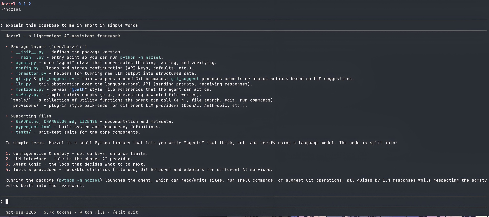

<p align="center">
  
</p>

# Hazzel

A small terminal coding agent. Bring your own key.

[](https://pypi.org/project/hazzel/) [](https://www.python.org/) [](LICENSE)

Hazzel lives in your terminal. It reads code, edits files, runs commands, and works with git — always with your approval first.



```bash
pip install hazzel
cd your-project
hazzel
```

Run `/model`, pick a provider, paste your key. Keys are stored at `~/.config/hazzel/config.json` with `0600` permissions. Env vars (`OPENAI_API_KEY`, `ANTHROPIC_API_KEY`, `MISTRAL_API_KEY`, `GROQ_API_KEY`) work too.

```
❯ Fix the failing test in tests/test_agent.py

  ● read_file   tests/test_agent.py
  ● edit_file   src/hazzel/agent.py
  ● run_command pytest -q — passed
```

## Why Hazzel?

Most coding agents keep getting bigger. Hazzel stays small on purpose.

The model suggests what to do. Hazzel decides whether and how to do it. Every mutation goes through you: file changes show a diff before they apply, shell commands ask first, and destructive git stays blocked.

If you want the most feature-heavy agent, there are better options. If you want a terminal agent you can see through, that's Hazzel.

## What it does

- Read, search, and list your codebase. Tag files with `@path` to put them in context.
- Create and edit files with diff preview and approval. Undo with `/undo`.
- Run shell commands with approval and timeout, sandboxed to your project root.
- Plan mode (`/plan on`): read-only exploration. Hazzel proposes a numbered plan, changes nothing until you run `/plan off`.
- Prove mode (`/prove on`): smoke-checks Python edits in `/tmp` before you trust them.
- Git-native: `/status`, `/diff` with file browser, `/commit` with suggested message, `/branch`, `/log`, `/push`, `/pull`, `/sync`. No `--force`, no `reset --hard` via shell.
- Streams responses with per-turn token usage (`/usage`).

## Providers

Bring your own key. No subscription.

- Groq (default: `openai/gpt-oss-120b`)
- OpenAI
- Anthropic
- Mistral

Switch anytime with `/model`.

## What it is not

Early-stage (v0.1.6). Expect rough edges.

No web browsing, no pull requests, no deploys, no background agents, no session persistence across restarts. It doesn't replace your editor — it stays in the terminal next to it.

## Contributing

Issues and pull requests welcome.

## License

AGPL-3.0-or-later. See [LICENSE](LICENSE).

---

If it fits your workflow, star the repo. It helps other terminal-first developers find it.
