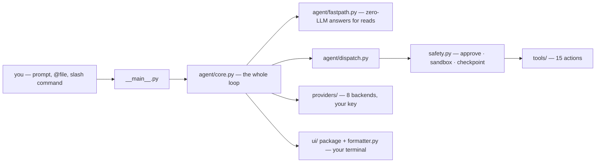

<p align="center">
  
</p>

<h1 align="center">Hazzel</h1>

<p align="center">
  <b>A terminal coding agent you can actually read.</b><br/>
  Bring your own key. No subscription. Every change shown as a diff before it touches disk.
</p>

<p align="center">
  <a href="https://github.com/mukundzha/hazzel/actions/workflows/ci.yml"></a>&nbsp;
  <a href="https://pypi.org/project/hazzel/"></a>&nbsp;
  <a href="https://pypistats.org/packages/hazzel"></a>&nbsp;
  <a href="https://github.com/mukundzha/hazzel/actions/workflows/ci.yml"></a>&nbsp;
  <a href="LICENSE"></a>&nbsp;
  <a href="https://github.com/mukundzha/hazzel/stargazers"></a>
</p>

<p align="center">
  
</p>

> First external PR merged in v1.5.1 — [good first issues are open](https://github.com/mukundzha/hazzel/issues?q=is%3Aissue+is%3Aopen+label%3A%22good+first+issue%22).

**Recently shipped:** dead UI stub removal — smaller surface, same terminal (1.5.6) · background jobs `wait`/`clear` — block until done, drop finished (1.5.5) · ask-once approvals — one y/N ends it, never asked twice (1.5.4) · `NO_COLOR` support — piped logs stay plain (#12, @DYNOSuprovo) · v1.5.3 SEO landing page · confirmation prompts accept `yes` — first external contribution (@Gambit-Checkmate, 1.5.1) · `/review` (1.5.0) — [full changelog](CHANGELOG.md)

## Try it in your project

Every agent claims transparency. Hazzel is ~10k lines of Python you can trace end to end — `agent/core.py` is the whole loop, `tools/` is every action it can take, `safety.py` is the entire undo system — and it stops before every write to show you what's about to happen.

```bash
uvx hazzel                  # try it — nothing installed, no venv touched (or: pipx run hazzel)
pip install hazzel          # to keep it (or: uv tool install hazzel · pipx install hazzel)
export GROQ_API_KEY="..."   # or skip this and pick a provider inside with /model
cd your-project
hazzel
```

<sub>If it fixes one failing test, [star it](https://github.com/mukundzha/hazzel) so the next person finds it too.</sub>

```text
❯ Fix the failing test in tests/test_agent.py

  ● read_file   tests/test_agent.py
  ● edit_file   src/hazzel/agent/core.py
  ● run_command pytest -q — passed
```

**Things you can say on day one**

```text
❯ /review --staged
❯ /commit
❯ what does agent/fastpath.py do — is it just caching?
❯ @screenshot.png make the nav match this
```

No project quiz, no config ceremony — the read-only commands answer instantly, and anything that touches disk stops at a diff first.

## Why it's built this way

Most agents ask you to trust a black box. Hazzel asks you to trust three specific, inspectable mechanisms instead:

* **Every write is a diff you approve, first.** Shell commands too — except a small allowlist of true read-onlys (`ls`, `cat`, `git status`) that skip the queue. And one decision sticks: approve or deny once per turn, never re-prompted for the same call.
* **Every write is checkpointed, automatically.** Prior bytes snapshotted to `~/.config/hazzel/undo/` (200 events, 20 per file) before anything lands. `/undo` restores them.
* **Commands are sandboxed to your project root.** `git reset --hard` and `clean` are blocked outright; raw `git commit` is steered into `/commit` with its own diff preview.

You can verify all three claims in about 200 lines: `src/hazzel/safety.py`, `src/hazzel/tools/run_command.py`.



## How it compares

Where Hazzel stands out, measured against the tools people actually compare it to:

| Capability | Hazzel | Aider | Cloud agents |
| ---------- | ------ | ----- | ------------ |
| Price model | free · BYOK | free · BYOK | subscription |
| Local models | Ollama, keyless, zero config | supported, needs env setup | no |
| Readable end to end | ~10k lines | tens of thousands | closed source |
| `/undo` without git | byte-level snapshots | git-commit based | varies |
| MCP client | stdio, zero new deps | — | varies |

Aider is excellent — this is about fit, not superiority.

## What it actually does

| What | In practice |
| ---- | ----------- |
| Understands your repo | Reads, searches, lists. `@path` pins a file into context; `/init` drafts an `AGENTS.md` map so every session starts oriented. |
| Ships real changes | Diff-preview editing, `/undo` checkpoints, shell with timeouts, `!cmd &` background jobs via `/jobs`, `fetch <url>` for docs, `@image.png` for vision-capable models. |
| Speaks fluent git | `/status` · `/diff --staged` · `/review` · `/commit` (auto-drafted Conventional message) · `/log` — reads run instantly, zero LLM round-trip. |
| Extends without lock-in | Minimal MCP stdio client — standard library only, any server via `.hazzel/mcp.json`. `SKILL.md` skills load on demand. Neither needs Hazzel-specific tooling to author. |
| Shows you the bill | Provider-reported tokens parsed into real dollars, logged locally — not estimated. Live `tokens · $` line every turn; `/usage today\|week\|month --by-model`, `/budget`. |
| Remembers between sessions | Per-project sessions persist with `/session restore`. `/plan on` explores read-only first; `/think on` buys extended reasoning for hard edits. |
| Works in a pipeline | `hazzel -p "prompt"` runs one turn and exits — pipe a diff in, get a summary out. `--output-format json` + real exit codes for CI. |

Worked transcripts of `/review`, `/commit`, `@image`, background jobs, and `hazzel -p` live in [docs/EXAMPLES.md](docs/EXAMPLES.md).

## Providers — bring your own key, no subscription

Eight providers, one env var each. Set the one you want and skip the in-app prompt:

| Provider | Env var | Notes |
| -------- | ------- | ----- |
| Groq | `GROQ_API_KEY` | default model runs here |
| OpenAI | `OPENAI_API_KEY` | |
| Anthropic | `ANTHROPIC_API_KEY` | |
| Mistral | `MISTRAL_API_KEY` | |
| Gemini | `GEMINI_API_KEY` | |
| DeepSeek | `DEEPSEEK_API_KEY` | |
| OpenRouter | `OPENROUTER_API_KEY` | 100+ models behind one key |
| Ollama | *(none)* | fully local, keyless, `OLLAMA_HOST` override |

Switch anytime with `/model`. Nothing is metered by Hazzel — you pay your provider directly, or nothing at all if you're running local.

## Commands at a glance

| Group      | Commands                                                                              |
| ---------- | ------------------------------------------------------------------------------------- |
| Modes      | `/model` · `/plan on\|off` · `/think on\|off` · `/goal [@objective]`                   |
| Git        | `/status` · `/diff [--staged]` · `/review [--staged]` · `/commit` · `/log`             |
| Cost       | `/usage [today\|week\|month\|--by-model]` · `/budget`                                  |
| Extend     | `/mcp [server [tool]]` · `/skills [name]` · `/init`                                   |
| Transcript | `/export` · `/copy` · `/retry` · `/jobs` · `/undo [n]` · `/session restore` · `/clear` |

Type `/` to filter live, `@` to attach a file, `/docs` to page the full guide without leaving the terminal — see [docs/EXAMPLES.md](docs/EXAMPLES.md) for worked transcripts.

## What it's honest about not being

v1.5.6, early-stage. No autonomous PRs, no cloud dashboard, no session sync across machines. It doesn't replace your editor — it sits in the terminal next to it, and it stays small on purpose.

If you need a heavier, more automated agent, better options exist. If you want to see exactly what's about to happen to your files before it happens, this is built for that.

## Support Hazzel

If Hazzel is useful, the cheapest support costs nothing — use it, report what breaks, or send a PR. It's free and open-source, and it plans to stay both.

If you'd rather throw money at the problem, that works too. It goes straight into maintainer time for docs, fixes, and reviews:

<p align="center">
  <a href="https://paypal.me/mukundzi">
    
  </a>
</p>

<p align="center">
  <sub>Star history</sub><br/>
  <a href="https://star-history.com/#mukundzha/hazzel&Date">
    <picture>
      <source media="(prefers-color-scheme: dark)" srcset="https://api.star-history.com/svg?repos=mukundzha/hazzel&type=Date&theme=dark" />
      <source media="(prefers-color-scheme: light)" srcset="https://api.star-history.com/svg?repos=mukundzha/hazzel&type=Date" />
      
    </picture>
  </a>
</p>

## Contributors

<p align="center">
  <a href="https://github.com/mukundzha"></a>
  &nbsp;&nbsp;
  <a href="https://github.com/ronaldsterners"></a>
  &nbsp;&nbsp;
  <a href="https://github.com/Gambit-Checkmate"></a>
  &nbsp;&nbsp;
  <a href="https://github.com/DYNOSuprovo"></a>
  &nbsp;&nbsp;
  <a href="https://github.com/HarshRajSinghania"></a>
  &nbsp;&nbsp;
  <a href="https://github.com/binaryCoder-101"></a>
  &nbsp;&nbsp;
  <a href="https://github.com/pollychen-lab"></a>
</p>

<p align="center">
  <sub>every PR lands through the same door — reviewed, CI-verified on four Python versions, credited in the release notes.</sub>
</p>

## Contributing

Issues and PRs genuinely welcome — [ROADMAP.md](ROADMAP.md) tracks what's next, [CONTRIBUTING.md](CONTRIBUTING.md) has the ground rules (small, inspectable, no new deps without asking), and good first issues are labeled as such.

## License

AGPL-3.0-or-later. See [LICENSE](LICENSE).

Why AGPL? It keeps hosted clones open — if you run Hazzel as a service, share your changes back. Normal use (install it, use it at work, ship code it helped you write) is unaffected — only re-hosting Hazzel itself triggers share-alike. If the license blocks adoption at your company, [open an issue](https://github.com/mukundzha/hazzel/issues/new?template=feature_request.md) — dual-licensing is on the table with enough demand.

<p align="center">
  <sub>Small tools stay small because people who find them useful say so.<br/>
  If Hazzel is now sitting in your terminal next to your editor,
  <a href="https://github.com/mukundzha/hazzel">a star</a> is how the next person finds it too.</sub>
</p>
